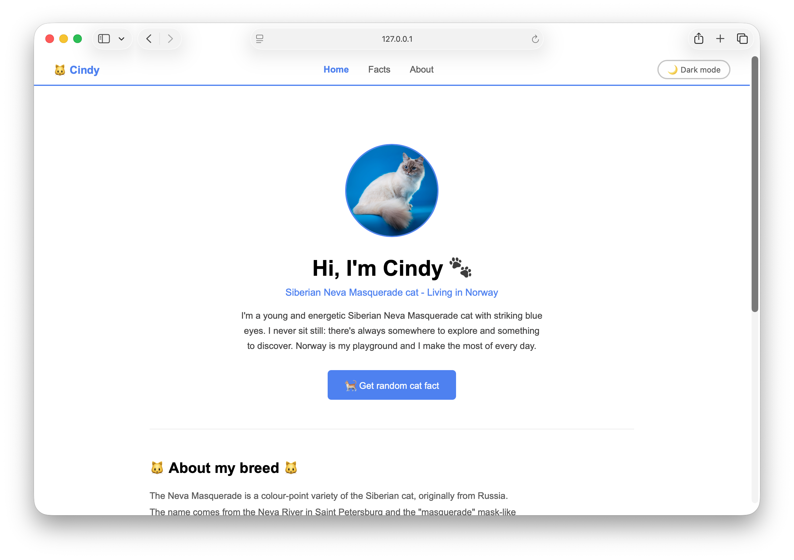
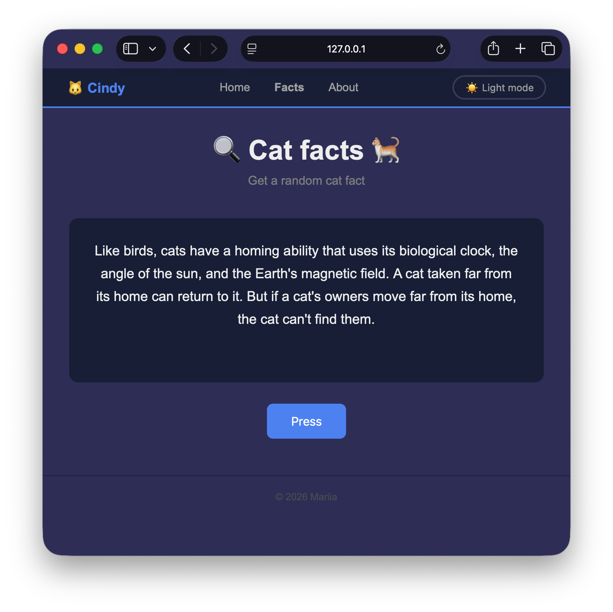

# 🐱 Cindy the Cat

This is a project for course Fundamentals of Web Applications at Oulu University of Applied Sciences

This is a personal website about cat Cindy. She is a young Siberian Neva Masquerade cat and she lives in Norway.

## Video

- [Youtube](https://youtu.be/qjjFM7Yx5HE)

 
## Pages
 
- **Home** — introduction and general information about Cindy
- **Facts** — random cat facts fetched from an open API
- **About** — contact information

## Features
 
- 🌙Dark / light mode toggle (saved in localStorage)
- 🐾 Random cat facts from [catfact.ninja](https://catfact.ninja) API
- 📱 Responsive design: works on mobile and desktop

## Technologies
 
- HTML
- CSS
- JavaScript


## How to run
 
1. Clone the repository
2. Open the project in VS Code
3. Install the Live Server-extension
4. Open index.html with the Live Server-extension

## Project structure
```
├── index.html        # Home page
├── facts.html        # Facts page
├── about.html        # Contact page
├── css/
│   ├── style.css     # Shared styles
│   ├── index.css     # Home page styles
│   ├── facts.css     # Facts page styles
│   └── about.css     # About page styles
├── js/
│   └── functions.js  # Dark/Light mode + cat facts logic
├── img/
│   └── 1.jpg         # Cindy's photo
├── pictures/
│   ├── 1.png
│   └── 2.png
└── README.md
 ```

## API
 
Free and open API that is used in this project: [catfact.ninja](https://catfact.ninja). 
**No API key needed.** 
 
## Author
This project is made by [@ecedevere](https://github.com/ecedevere)


## Screenshots

* Main page:



* Dark mode and random fact:



## License
This project is licensed under the [MIT License](LICENSE).